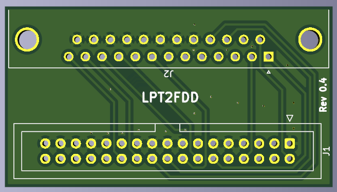
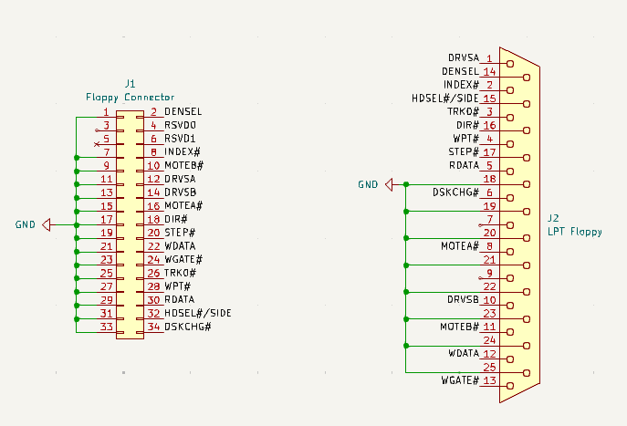
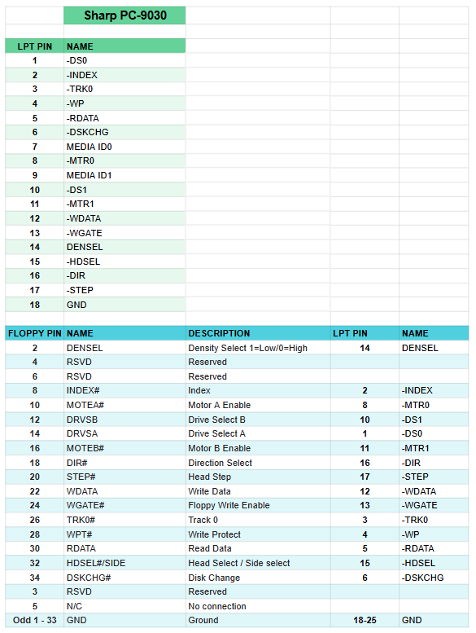

# LPT2FDD
LPT to Floppy Drive adapter for supported vintage laptops. This revision is specifically designed for the Sharp PC-9000 / 9030 series laptops but may also work on clones or subsequent Sharp laptops as well. The laptop must support floppy protocol through the LPT port for this to work. This project also serves as an archive for pin sets required for LPT floppy protocols.

 
More documentation and demonstrations will be provided in the future. 

## Support the Developer
This project is brought to you free and open source, but it is not free to develop. If you like this project please consider supporting this and future developments. 

https://www.patreon.com/RetroLoom